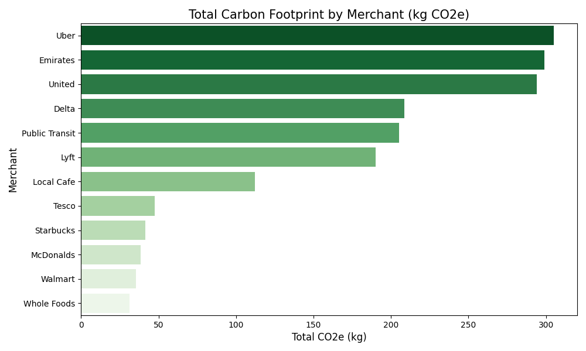

# 🌍 Eco-Tracker: Fintech ESG Solution
**A Data-Driven Framework for Sustainable Banking**

## 📖 Overview
The **Eco-Tracker** is a proposed feature for digital banking apps that allows users to monitor the carbon footprint of their spending in real-time. By mapping Merchant Category Codes (MCC) to CO2e emission factors, the system provides actionable sustainability insights to the consumer.

---

## 🧠 The Business Logic (How it Works)
To ensure the tracker is both accurate and scalable, I developed a logic flow based on the following steps:
1. **Extraction:** Capture raw transaction data (Amount, Merchant Name, MCC).
2. **Enrichment:** Map the MCC to a specific Carbon Factor (e.g., *Airline travel = 0.15kg CO2/$*).
3. **Calculation:** Compute the carbon impact: `Amount * Emission Factor`.
4. **Visualization:** Categorize the data into a Monthly Sustainability Dashboard.


---

## 🚀 Repository Structure & Artifacts
This repository serves as a full "Project in a Box" for a Business Analyst or Product Manager.

* **[Product Strategy (PRD)](./PRD.md):** Defines the "Why." Includes market research, user personas, and the feature roadmap.
* **[Data Requirements](./Data_Dictionary.md):** Defines the "How." A detailed schema of the database fields and carbon logic.
* **[User Stories & AC](./User_Stories.md):** The "Instructions" for developers, written with clear Acceptance Criteria.
* **[Risk Management](./Risk_Register.md):** A 5x5 Matrix identifying potential blockers like data privacy (GDPR) and API reliability.

---

## 💻 Technical Setup (For Developers/BAs)
I have included a Python-based synthetic data engine to allow for immediate testing of the logic without using sensitive PII (Personally Identifiable Information).


### 1. Generate the Data
Ensure you have `pandas` and `faker` installed, then run:
`python3 scripts/generate_data.py`

### 2. Analyze the Output
The script generates `data/transactions_synthetic.csv`, which contains 100+ simulated bank transactions ready for SQL or PowerBI analysis.

---

## 💡 Key Skills Showcased
* **Requirements Gathering:** Translating ESG goals into technical specs.
* **Data Modeling:** Designing CSV schemas for environmental tracking.
* **Python for BA:** Automating data generation for UAT (User Acceptance Testing).
* **Stakeholder Management:** Communicating risk and vision via visual flowcharts.

### 🛠️ Process Flow
```mermaid
graph LR
    A[Transaction] --> B(Categorization)
    B --> C{Carbon Engine}
    C --> D[User Dashboard]
    D --> E[Offset Actions]
